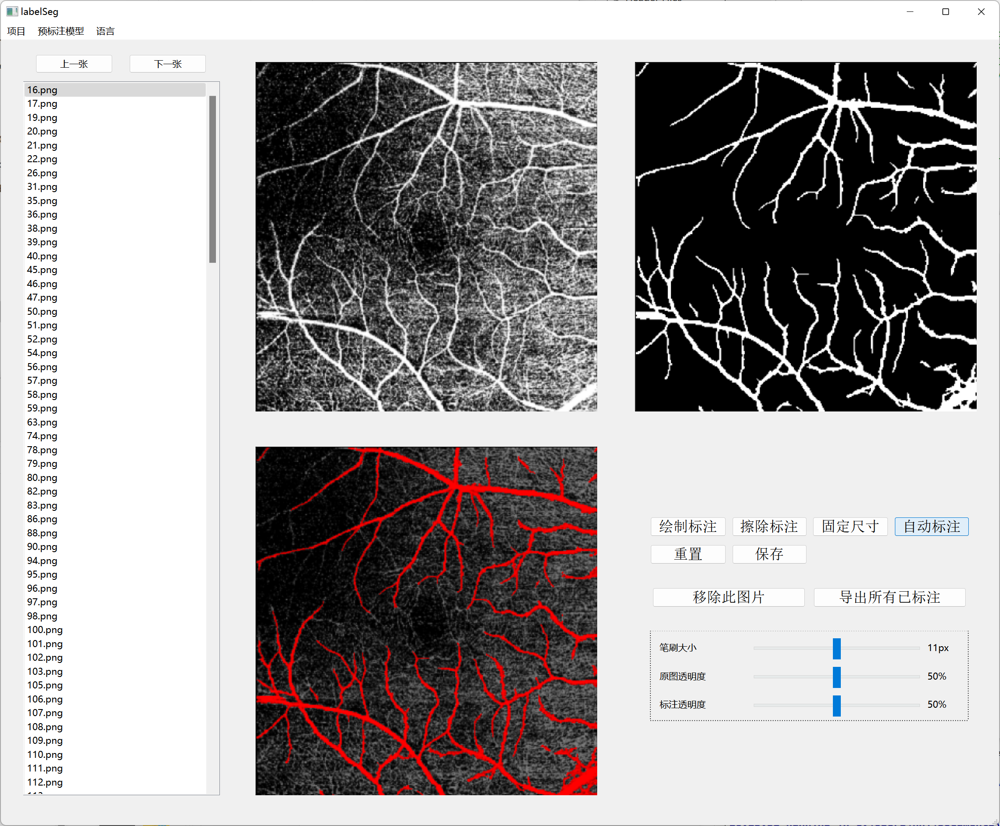

# labelSeg

#### 介绍

labelSeg是一个针对语义分割的标注工具，旨在通过自动标注和少量的手动矫正，在得到高质量标注图的同时大幅度减少标注所需的时间。自动标注是通过一个预标注的卷积神经网络完成的。

目前，软件只支持对二分类的语义分割进行标注（即0-1标签）。

支持中英双语，可以在菜单栏进行切换。

标注流程：打开图片后，点击右下角的“自动标注”按钮，产生一张初步的自动标注（如下图）。可以使用鼠标作为画笔在标注图上进行修改和矫正，左键绘制，右键擦除。



快捷键：
CTRL+S: 保存
CTRL+Z: 撤回
I: 增加笔刷大小
J: 减小笔刷大小
↑: 上一张图片
↓: 下一张图片
滚轮上: 上一张图片
滚轮下: 下一张图片

#### 依赖库
Qt 6.4
OpenCV 4

#### 安装教程

1.  使用Qt Creator打开项目

2.  将CMakeLists.txt中，

```
set(OpenCV_DIR C:/Libs/Opencv4/opencv/build/x64/vc15/lib)
```
替换为
```
set(OpenCV_DIR YOUR_OPENCV_PATH)
```

3.  以Release模式编译运行


